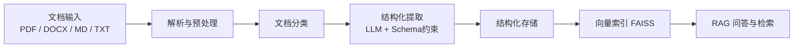

# 毕业设计中期汇报

**题目**：基于大模型的软件工程文档内容结构化提取系统设计与实现

---

## 一、问题与价值

软件工程文档，如 SRS、API 文档、测试报告等，普遍以非结构化形式存储。传统提取手段，如关键词匹配、正则规则和传统 NLP 模型，在语义理解和复杂结构抽取方面存在明显局限。

大模型的优势在于语义级理解与结构化提取。例如：

- 输入：`系统应该允许管理员删除用户账户。`
- 输出：`{ "module": "用户管理", "function": "删除用户", "type": "功能需求" }`

**项目核心价值**：将非结构化软件工程文档转化为可检索、可复用的结构化数据，服务于 AI 编程、研发协作、知识沉淀与文档治理等场景。

---

## 二、系统架构

系统采用“**解析 -> 分类 -> 提取 -> 索引 -> 问答**”的轻量化分层架构：

**技术栈**：

| 层次 | 技术 |
|------|------|
| 后端 | FastAPI + Tortoise-ORM + SQLite |
| 解析 | pymupdf4llm（PDF）、python-docx（DOCX） |
| 提取 | DashScope / Qwen（OpenAI-Compatible）+ Pydantic |
| 检索 | FAISS + text-embedding-v4 |
| 前端 | Vue 3 + Tailwind CSS |

---

## 三、已完成工作

系统已实现完整 MVP 闭环，支持 **7 类**软件工程文档的结构化提取与知识问答：

> SRS 需求规格 / API 接口文档 / 系统设计说明书 / 测试计划 / 测试用例 / 测试报告 / 用户手册

**核心能力**：

1. **多格式解析**：统一接入 PDF、DOCX、MD、TXT，输出标准化 Markdown 供后续处理。
2. **智能分类与结构化提取**：LLM 自动识别文档类型，结合预定义 Pydantic Schema 输出结构化 JSON。
3. **长文档分块处理**：超阈值文档自动分块调用、结果合并去重，并具备三段降级容错机制。
4. **语义分块（Chunker）**：识别段落、列表、表格、代码块，自动补切与合并，生成适合向量化的语义片段。
5. **RAG 知识问答**：FAISS 向量召回 + LLM 生成答案，返回带评分引用，具备一定可解释性。

后端已完成上传、查询、删除、重建索引、问答等核心接口，前端支持文档管理、问答交互与 JSON 结构展示。

---

## 四、下一步计划

| 优先级 | 任务 | 目的 |
|--------|------|------|
| 高 | 评估 DeepSeek、Qwen 等模型的抽取表现，对比准确率与性价比 | 论文模型选型依据 |
| 高 | 对比多维 Prompt 策略（语言、粒度、角色设定、结构约束）对提取质量的影响 | 论文 Prompt 对比实验 |
| 高 | 收集软件工程文档数据集，测试长文档场景下系统稳定性 | 验证系统鲁棒性 |
| 中 | 将 LLM 调用改为异步，提升并发处理性能 | 系统性能优化 |
| 中 | 支持 URL 输入，抓取在线文档 | 扩展输入来源 |
| 中 | 支持错误报告（Bug Report、GitBugs） | 扩展文档覆盖范围 |

### 方案对比与后续思考

**方案 A（当前方案）**

- 解析器 + LLM 抽取

**方案 B（模型原生）**

- `qwen-doc-turbo` 直接读文件

思考方向：

- 是否将方案 B 作为回退方案，或与方案 A 结合以增强结果质量？
- 该方案支持约 250k 输入和 260k 上下文，约等于近 20 万字中文。
- 支持多种文件类型、图片、URL，并可直接进行文档对话。
- 但其更适合作为增强辅助，持久化与结构化输出能力仍需结合现有系统设计。

参考：

- https://help.aliyun.com/zh/model-studio/data-mining-qwen-doc

**方案 C（开源替代）**

- Qwen 2.5 / LLaMA 3 / Qwen 7B
- `marker / unstructured -> 全文本 -> Qwen-14B-128K -> Outlines -> JSON`

### 相关工具判断

> RAGFlow 提供完整的文档检索增强生成框架，但其侧重问答与检索，对复杂结构化信息抽取支持有限，不适合作为核心抽取引擎。

> FastPDF 在 PDF 解析方面表现优异，但缺乏统一抽取与结构化能力，仅适合作为底层解析组件。

> PrivateGPT 更适用于隐私场景下的文档问答，但受限于本地模型能力，其结构化抽取精度难以满足软件工程文档处理需求。

### 值得重点学习

**LlamaIndex + Outlines**

- 定位：专业级信息抽取 Pipeline
- 优点：
  - 强 Schema 控制（Outlines）
  - 强 Pipeline 能力
  - 支持结构化输出（JSON 严格约束）
  - 可替换模型（Qwen / LLaMA）
- 缺点：
  - 工程复杂
  - 需要自行搭建全部组件
  - 依赖本地模型质量

### 可继续探索的问题

- `qwen-doc-turbo` 是否可作为结构化抽取的增强或兜底方案？
- 是否可以在“文档文类识别”阶段引入轻量深度学习分类模型，实现 DL + LLM 结合？
