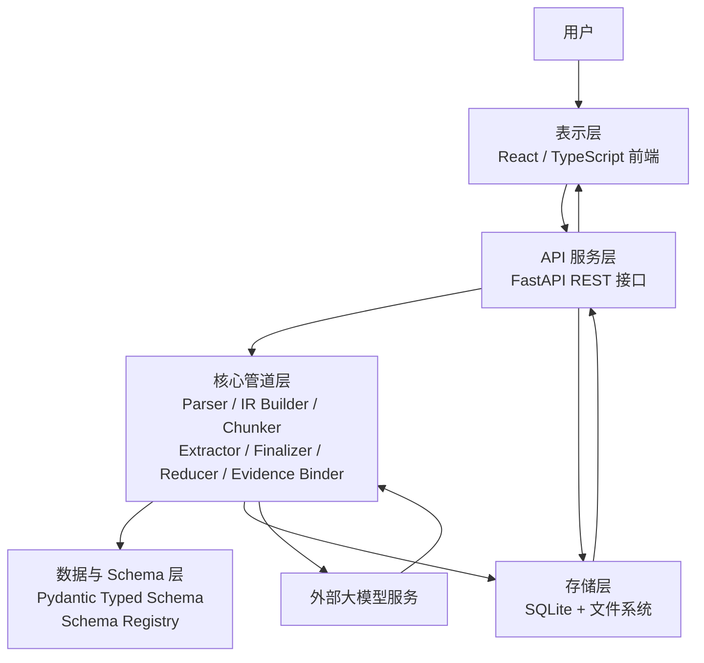

# 第三章 系统设计

## 3.1 总体架构

DocStruct 采用前后端分离架构。后端分五层：存储层（SQLite + 文件系统）、数据层（Pydantic v2 + Schema Registry + Tortoise ORM）、核心管道层（Parser / IR Builder / Chunker / Extractor / Finalizer-Reducer / Evidence Binder）、API 服务层（FastAPI，8 个 RESTful 接口）和外部 LLM 服务层。

图 3-1 系统总体架构



系统主流程：上传后 Parser 产出 Markdown 和 Document IR → LLM 生成摘要 → Chunker 按章节边界分块 → Extractor 并发调用 LLM 逐块抽取（Map）→ Finalizer/Reducer 去重合并（Reduce）→ Evidence Binder 关联原文 → 结果入库并返回前端。

图 3-2 结构化抽取主流程

```text
文档上传
    ↓
Parser → Markdown + Document IR
    ↓
LLM 生成 Summary
    ↓
Section-aware Chunking
    ↓
Map：分块并发抽取（Semaphore 限流）
    ↓
Finalizer（失败回退 Reducer）
    ↓
Reducer：确定性去重 + 全局 ID
    ↓
Evidence Binding
    ↓
保存 extracted_data 返回前端
```

## 3.2 数据模型设计

系统数据模型分四层：文档记录、Document IR、抽取类型系统和 Evidence 记录。

**文档记录。** Tortoise ORM 映射到 SQLite，字段包括 id、title、doc_type、status（pending/processing/completed/failed）、file_path、raw_text、summary、document_ir（JSON）和 extracted_data（JSON）。created_at/updated_at 由 ORM 维护。修改 raw_text 时自动清除旧 IR。

**Document IR。** 解析后的统一中间表示，核心结构为元素列表和章节大纲。每个元素 `DocumentElement` 包含 element_id（全局递增，如 `el-0001`）、element_type、markdown、text、page、bbox、reading_order 和 section_path。element_id 是分块标注、LLM 证据引用和证据绑定的统一锚点。章节大纲以嵌套结构记录各章标题及起止元素 ID。

**抽取类型系统。** 基于 Pydantic v2 三层继承。`BaseNode` 定义 id、name 和 evidence_element_ids；`BaseExtractedDocument` 定义 doc_type、title、version、summary 和全局 evidence 列表。五类文档的具体模型通过多重继承组合。以 SRS 为例：FunctionalReqItem（name、points、actor、priority、category、acceptance_criteria）、NonFunctionalReqItem（name、category、description）和 BusinessFlowItem（name、actor、steps、outcome）。API 文档的 ApiItem 包含 method、path、request_parameters、response_fields 和 error_codes。HLD 文档包含 ModuleItem、CoreFlowItem 和 DesignDecisionItem。字段中使用 field_validator 将中文枚举值（"高"/"中"/"低"）归一化为英文枚举，减少 LLM 输出差异导致的校验失败。

**Evidence 记录。** 连接对象与原文，每条含 object_id、element_id、text_span（截取前 500 字符）、page 和 bbox。

## 3.3 抽取契约设计

`ExtractionContract` 由 response_model 动态生成，将"抽取什么"与"如何抽取"解耦。契约包含：文档级标量字段（system_name、base_url 等）；对象槽位列表（functional_requirements、apis 等）；通用规则（只抽取原文已存在对象、evidence_element_ids 须来自当前块允许列表、未出现槽位返回空列表、禁止编造数据）；忽略章节列表（参考文献、术语表、附录等）。新增文档类型时只需定义 Pydantic 模型并注册，契约自动生成，管道代码复用。

## 3.4 分块策略设计

采用章节感知分块，以 Document IR 的章节边界为参考面，优先在章节内部切分。算法：遍历元素列表，按章节路径归入单元组（忽略章节直接跳过）；在组内沿元素顺序累加至超过 max_chars（默认 5000）；单个超大元素沿边界拆分。相邻块间保留 200 字符重叠窗口——从前一块尾部逆向选取元素前置到当前块头部，恢复跨块边界语义上下文。

分块内容渲染时，每个元素前插入 `[ELEMENT: el-0123 page=5]` 标记，作为 LLM 声明证据引用的 ID 锚点。同时传入 allowed_evidence_element_ids 列表，严格限定 LLM 只能引用当前可见元素。

## 3.5 合并与证据绑定设计

两级合并策略：LLM Finalizer → 确定性 Reducer（Fallback）。

Finalizer 设计约束：不读完整原文（只收大纲、摘要、契约和块候选），要求 LLM 去重、保留 evidence_element_ids、维持层次结构、禁止引入新事实。失败时回退 Reducer。

Reducer 执行流程：动态发现槽位（遍历 response_model 类型注解，检查 `__origin__` 是否为 list）→ 文档级字段按类型合并（字符串取长不取空，列表去重）→ 对象槽位按身份键去重。身份键层级：name + 类型字段（如 entity_type、method）优先，LLM 分配的 id 次之，JSON 序列化兜底。匹配后按字段级合并：字典递归，列表去重追加，字符串取长。合并完成后分配全局 ID（前缀由槽位名映射：FREQ/NFR/APIS/MOD/TC/TBL + 数字序号）。

证据绑定阶段读取 evidence_element_ids，仅保留 IR 中实际存在的元素 ID，生成 evidence 记录。计算 evidence coverage（有证据对象数 / 总对象数）作为置信度近似指标。

## 3.6 接口设计

表 3-1 后端接口

| 方法 | 路径 | 说明 |
| --- | --- | --- |
| POST | `/api/upload` | 上传文件，后台触发处理流水线 |
| GET | `/api/documents` | 文档列表（支持状态和类型筛选） |
| GET | `/api/documents/{id}` | 文档详情（含 extracted_data 和 evidence） |
| PATCH | `/api/documents/{id}` | 修订 raw_text/summary/extracted_data |
| DELETE | `/api/documents/{id}` | 删除记录与文件 |
| GET | `/api/documents/{id}/chunks` | 分块调试数据 |
| POST | `/api/documents/{id}/retry-extraction` | 重新执行抽取 |
| GET | `/api/documents/{id}/file` | 下载原始文件 |

上传接口通过 BackgroundTasks 异步化，请求快速返回文档 ID，前端轮询状态。接口数据格式 JSON，字段命名 camelCase（Pydantic alias_generator 自动转换），数据库 snake_case。
