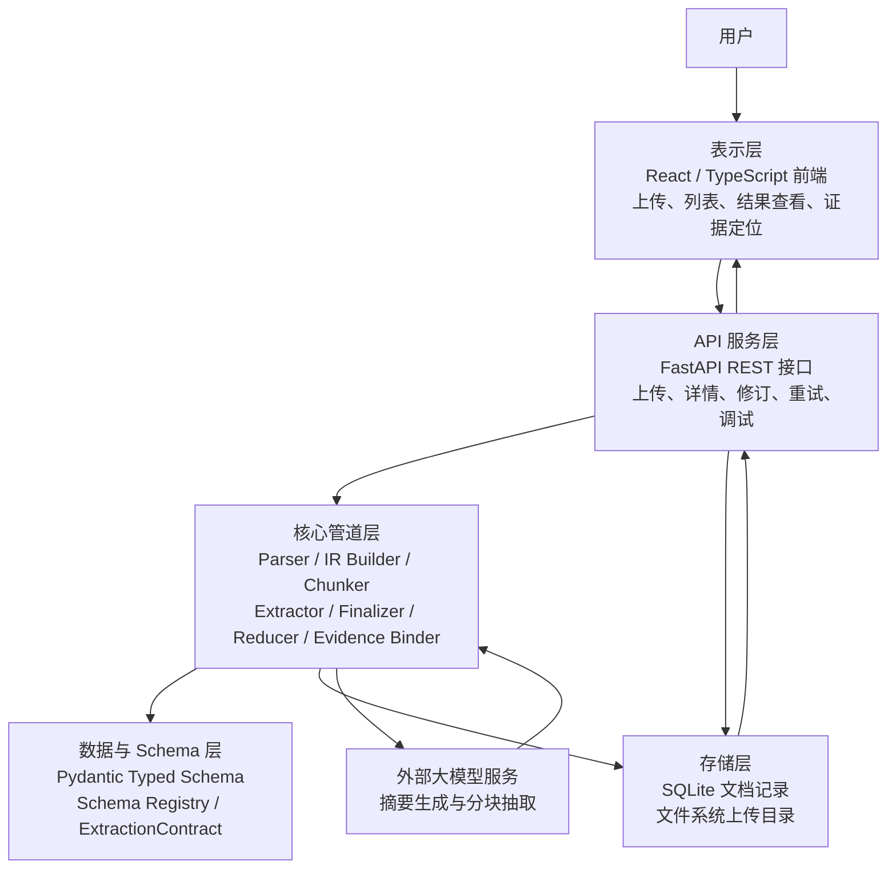

# 第三章 系统设计

## 3.1 总体架构

DocStruct 采用前后端分离架构。后端负责文件接收、文档解析、结构化抽取、结果存储和 API 服务；前端负责用户交互、文档列表展示、结构化结果查看和证据定位。

后端可分为五层。存储层使用 SQLite 和文件系统保存文档记录与上传文件。数据层使用 Pydantic、Schema Registry 和 Tortoise ORM 定义数据结构。核心管道层包含 Parser、IR Builder、Chunker、Extractor、Reducer 和 Evidence Binder。API 服务层基于 FastAPI 提供 RESTful 接口。表示层由 React 前端实现。

图 3-1 DocStruct 系统总体架构



系统主流程如下。

图 3-2 系统结构化抽取流程

```text
文档上传
    ↓
Parser 生成 Markdown 与 Document IR
    ↓
LLM 生成 Summary
    ↓
Section-aware Chunking
    ↓
Map：分块局部抽取
    ↓
Finalizer / Reduce：候选合并与去重
    ↓
Evidence Binding
    ↓
保存 extracted_data 并返回前端
```

## 3.2 数据模型设计

系统数据模型包括文档记录、Document IR、抽取 Schema 和 evidence 四类核心结构。

文档记录保存标题、文档类型、状态、上传路径、raw_text、summary、document_ir 和 extracted_data 等字段。该记录是前后端交互的主要实体。

Document IR 是解析后的统一中间表示，包含标题、文档类型、元素列表和章节大纲。元素是后续分块和证据绑定的基本单位，每个元素具有稳定的 element_id。PDF 解析与布局恢复的相关研究表明，保留页面和版面信息有助于后续内容定位[4]，Docling 等文档转换工具也提供了类似的布局和表格解析能力[5]。

抽取 Schema 根据文档类型分别定义。SRS 文档包含 system_name、target_users、functional_requirements、non_functional_requirements 和 business_flows；API 文档包含 apis；概要设计文档包含 modules、core_flows 和 design_decisions；测试用例文档包含 test_cases；数据库设计文档包含 tables。

Evidence 用于连接结构化对象与原文元素。每条 evidence 至少包含 object_id 和 element_id，并尽量保存 text_span、page 和 bbox。对于 basic parser 或非 PDF 文档，page 和 bbox 可能为空，但 text_span 仍可用于文本证据展示。该设计对应带引用生成和事实性评估中对证据支撑的要求[7][8]。

## 3.3 抽取契约设计

系统通过 ExtractionContract 描述当前文档需要抽取什么。契约由 response_model 动态生成，包含文档类型、文档级字段、目标对象槽位、通用规则和忽略章节。

通用规则包括只抽取原文明确出现的对象、不编造内容、保持原文聚合粒度、evidence_element_ids 必须来自当前分块允许的元素 ID、未出现对象返回空列表等。忽略章节包括参考文献、术语表、附录等通常不属于主要结构化对象的内容。

抽取契约的作用是将“抽什么”和“如何抽”解耦。新增文档类型时，只要定义对应 Pydantic 模型并注册文档类型，核心抽取流程仍可复用。

## 3.4 分块设计

文档分块采用章节感知策略。系统根据 Document IR 中的元素顺序和章节路径生成 chunk，默认最大字符数为 5000，相邻分块默认重叠 200 字符。相比简单按固定长度切分，章节感知分块能够减少语义单元被截断的概率。

每个 chunk 都包含当前分块元素、章节路径、页码范围和 markdown 内容。Map 抽取时，提示词会提供当前分块允许引用的 evidence_element_ids。这样可以限制模型只能引用当前可见证据，减少证据编造。长文本处理中采用分块处理与聚合的思路，能够降低单次上下文输入过长带来的不稳定性[6]。

## 3.5 合并与证据绑定设计

分块抽取后，系统首先尝试使用 Finalizer 合并候选。Finalizer 只接收文档大纲、摘要、抽取契约和分块候选，不读取完整原文，避免退化为全文一次性抽取。如果 Finalizer 失败，系统回退到确定性 Reducer。

Reducer 负责收集各槽位对象，按名称和类型字段进行去重合并，为每个对象重新分配全局 ID。例如 functional_requirements 使用 FREQ 前缀，non_functional_requirements 使用 NFR 前缀，tables 使用 TBL 前缀。

证据绑定阶段读取对象中的 evidence_element_ids，并在 Document IR 元素表中查找对应元素。只有存在于 IR 中的 element_id 才会保留。最终生成 evidence 列表，并计算 evidence coverage 作为抽取置信度的近似指标。

## 3.6 接口设计

系统后端提供 8 个主要接口：上传文档、获取文档列表、获取文档详情、修订文档、删除文档、查看分块调试数据、重试抽取和下载原文件。接口设计围绕文档记录展开，便于前端以单文档为单位组织页面状态。

表 3-1 后端主要接口

| 方法 | 路径 | 说明 |
| --- | --- | --- |
| POST | `/api/upload` | 上传文件并触发后台处理 |
| GET | `/api/documents` | 获取文档列表 |
| GET | `/api/documents/{id}` | 获取文档详情 |
| PATCH | `/api/documents/{id}` | 修订原文、摘要或抽取结果 |
| DELETE | `/api/documents/{id}` | 删除文档记录与文件 |
| GET | `/api/documents/{id}/chunks` | 查看分块调试数据 |
| POST | `/api/documents/{id}/retry-extraction` | 重新执行结构化抽取 |
| GET | `/api/documents/{id}/file` | 下载原始上传文件 |

上传接口使用后台任务执行解析和抽取，使请求可以先返回文档记录 ID。用户随后通过列表或详情接口查看处理状态和结果。
