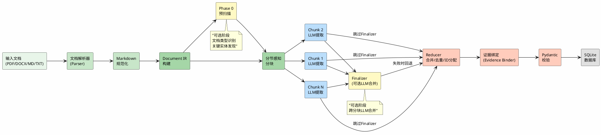
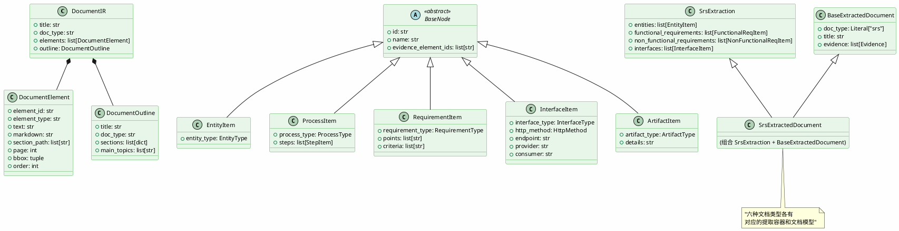

# 第四章 系统设计

## 4.1 系统总体架构

DocStruct 系统采用分层架构设计，自底向上分为五个层次：存储层、数据层、核心管道层、API 服务层和表示层。

**图4-1 系统总体架构图**

表示层 (Presentation)

证据对照 <small style="color: #94a3b8;">PDF.js + Bbox叠加</small>

Markdown校对 <small style="color: #94a3b8;">rehype + remark</small>

分块调试 <small style="color: #94a3b8;">Chunk Inspector</small>

React 18 + TypeScript + Vite + TanStack Query

API 服务层 (REST API)

POST /upload
GET /documents
GET /documents/{id}
PATCH /documents/{id}
GET /chunks
DELETE
POST /retry
GET /file

FastAPI + BackgroundTasks + asyncio

核心管道层 (Core Pipeline)

<b>Parser</b> <small>PDF/DOCX/TXT→MD</small>

→

<b>IR Builder</b> <small>DocumentIR</small>

→

<b>Chunker</b> <small>分节感知分块</small>

→

<b>Extractor</b> <small>LLM Map阶段</small>

→

<b>Reducer</b> <small>合并/去重/ID分配</small>

→

<b>Evidence Binder</b> <small>证据绑定</small>

可选组件: Phase 0 预扫描
Finalizer 二次合并

数据层 (Data)

Pydantic Models
Schema Registry
Tortoise ORM

存储层 (Storage)

SQLite (aiosqlite)
文件系统 (db/)

**存储层**负责原始文件、解析结果和提取结果的持久化。系统选用 SQLite 文件数据库作为唯一存储后端，所有数据（文档记录、Document IR、提取结果 JSON）均存储于单个数据库文件中，实现零配置部署和便捷的数据迁移。

**数据层**定义了系统的核心数据结构，包括 Pydantic 模型层次体系（BaseNode 及其子类、各文档类型的提取容器）和 ORM 模型（DocumentRecord）。Schema Registry 维护文档类型到提取模型的映射，为上层管道提供类型安全保障。

**核心管道层**是系统的处理中枢，按数据流向组织为五个串联阶段：文档解析（Parser）→ 中间表示构建（IR Builder）→ 分节感知分块（Chunker）→ Map-Reduce 提取（Extractor + Reducer）→ 证据绑定（Evidence Binder）。每个阶段具有明确的输入/输出契约，阶段之间通过标准化的数据结构（ParseResult → DocumentIR → list[DocumentChunk] → 提取结果 dict）衔接。

**API 服务层**基于 FastAPI 构建 RESTful 接口，提供文档上传、列表查询、详情获取、手动修订、分块调试、重新提取和文件下载等 8 个端点。上传接口采用后台任务机制，同步返回确认响应后异步执行解析与提取。

**表示层**为 React + TypeScript 构建的单页 Web 应用。核心交互模式为三个标签页：证据对照标签页（原文与提取结果的对开浏览）、Markdown 校对标签页（规范化文本的查看与编辑）和分块调试标签页（分块结果的检查）。

## 4.2 核心处理管道设计

系统的核心处理管道遵循 Map-Reduce 范式，将"局部 LLM 语义提取"与"全局确定性归约"分离，各司其职。管道包含以下阶段：

**图4-2 Map-Reduce 提取管道数据流图**

**阶段一：文档解析与规范化。** 系统通过 `ParserFactory` 工厂方法，根据文件扩展名或用户指定的解析后端选择合适的解析器。解析器将四种输入格式（PDF、DOCX、MD、TXT）统一转化为 `ParseResult`，其中包含规范化的 Markdown 文本和结构化的 `DocBlock` 列表。随后，IR 构建器将 `DocBlock` 列表转化为 `DocumentIR`，补充元素 ID、章节路径和页码信息。

**阶段二：Phase 0 预扫描（可选）。** 当启用 Phase 0 模式时，系统从文档的首部、中部和尾部各采样约三分之一的可配置预扫描预算（默认 6000 字符），向 LLM 发送轻量级分析请求。LLM 返回 `Phase0Result`，包含文档类型判断（含置信度）、关键实体列表、各章节主题归纳和提取提示。预扫描结果作为全局上下文注入后续每个分块的 LLM 调用，提升跨分块提取的一致性。

**阶段三：分节感知分块。** 系统将 `DocumentIR` 的元素列表按章节路径分组，然后基于可配置的目标块大小（默认 5000 字符）和重叠窗口（默认 200 字符）进行分块。分块器跳过术语表、参考文献和附录等非核心章节，并通过重叠窗口机制保留跨分块边界的上下文连续性。每个分块渲染时，为每个元素插入证据标记（`[ELEMENT: el-NNNN page=N]`）。

**阶段四：Map 并发提取。** 系统以受限并发数（默认 3）通过 `asyncio.gather` 并发调用 LLM，对每个分块进行局部提取。每个分块的 LLM 调用接收以下上下文：文档全局大纲、Phase 0 预扫描结果、提取契约（目标槽位、规则）、当前分块的 Markdown 文本（含元素标记）以及分块元数据（章节路径、页码范围、允许引用的元素 ID 列表）。LLM 按目标槽位输出提取对象，每个对象通过 `evidence_element_ids` 字段标注所引用的元素。

**阶段五：Finalizer 二次合并（可选）。** 若启用 Finalizer，系统将所有分块的提取结果、文档大纲和 Phase 0 上下文化为单次 LLM 调用，由 LLM 进行跨分块的候选合并、去重和层次化整理。该步骤本质上是利用 LLM 的语义理解能力对分块结果进行全局优化，但由于引入额外 LLM 调用，增加了时间和费用成本。Finalizer 失败时系统自动回退到确定性 Reducer。

**阶段六：Reducer 归约与证据绑定。** Reducer 是确定性后处理层，完成三项操作：第一，按槽位合并所有分块的提取对象；第二，基于槽位特定的身份标识进行去重（例如接口按 `endpoint + http_method` 合并，实体按 `name + entity_type` 合并）；第三，分配全局序号 ID（格式为 `<PREFIX>-NNNN`，如 `ENT-001`、`INT-003`）。随后，证据绑定器遍历所有提取对象的 `evidence_element_ids`，交叉验证其所引用的元素 ID 是否存在于原始 `DocumentIR` 中，为有效引用构建 `Evidence` 记录（含对象 ID、元素 ID、文本片段、页码和边界框坐标）。

**阶段七：最终校验与持久化。** 归约后的数据通过对应文档类型的 Pydantic 模型校验，校验通过后存入数据库的 `extracted_data` 字段，文档状态更新为 `"completed"`。

## 4.3 分块策略设计

分块策略是 Map-Reduce 管道中的关键设计决策，直接影响 LLM 提取的覆盖率和一致性。本系统的分块算法（`split_ir_into_chunks`）遵循以下设计原则：

**章节感知优先。** 分块器以"章节单元组"（Section Unit Group）为基本分组单位，将连续属于同一章节路径的元素聚合到一个组中。在合并元素为块时，优先将整个章节单元组放入同一个块，仅当组的总字符数超过目标上限时才进行切分。这一策略确保每个块在语义上是自包含的，减少因随意切分导致的上下文断裂。

**超大章节按元素边界拆分。** 对于字符数远超目标上限的单个大节（如在大型 SRS 文档中常见的长篇幅需求描述），分块器按元素边界进一步拆分为多个子分块。拆分时保证每个子分块包含完整的元素（不会在单个元素中间切分），并在元素标记中包含完整的章节路径信息。

**核非心章节过滤。** 分块器默认忽略以下类型的章节：术语表/Glossary、参考文献/References/Bibliography、附录/Appendix。过滤逻辑同时支持中英文变体名称。被忽略的章节元素不进入任何分块，也不参与后续提取。

**重叠窗口与尾部复制。** 相邻分块之间通过"尾部复制"机制维持上下文连续性。在生成第 N 个分块时，从前一个（第 N-1 个）分块的末尾贪心地选取元素（按字符数累计，不超过配置的重叠预算），将选取的元素注入到当前分块的首部。这些重叠元素在 LLM 处理当前分块时提供前文背景信息。

**分块元数据标注。** 每个分块对象除文本内容外，还携带以下元数据：`chunk_id`（唯一标识）、`section_path`（所属章节路径）、`page_start`/`page_end`（页码范围）、`elements`（包含的元素列表）以及一个合法的 `evidence_element_ids` 白名单（用于约束 LLM 的证据引用范围）。

## 4.4 Reducer 合并去重设计

Reducer 是整个管道中唯一的确定性后处理环节，其设计目标是：不依赖 LLM 的语义判断，通过规则化算法完成分块结果的合并、去重和 ID 分配，保证处理的可靠性和一致性。

**槽位发现（Slot Discovery）。** Reducer 通过 `discover_slots()` 函数对输出模型进行自省，筛选出类型为 `list[BaseNode 子类]` 的字段作为目标槽位。非槽位字段（如 `doc_type`、`title`、`evidence` 等文档级字段）被明确排除。这一动态发现机制使得 Reducer 无需硬编码槽位列表，新增文档类型只需修改对应的 Pydantic 模型即可自动适配。

**身份去重（Identity Deduplication）。** Reducer 为每个槽位定义特定的身份标识函数（`_identity_for_item`），按槽位类型选择最优的身份拼合策略：
- 对于接口槽位，当对象包含 `http_method` 和 `endpoint` 字段时，以 `<interface_type> + <http_method> + <endpoint>` 作为主身份——两个不同分块中描述同一 HTTP 端点的接口对象将被识别为同一对象。
- 对于实体槽位，以 `<entity_type> + <name>` 为身份标识。
- 对于需求槽位，优先保留原始文档中的需求编号（如 `REQ-001`），若缺失则以 `<requirement_type> + <name>` 作为身份。

每个去重组的候选对象被合并为一个对象：取其最长名称、最长文本描述，合并所有唯一的证据引用。去重组内若存在冲突（如两个候选对象的 `entity_type` 不一致），则保留首次出现的值并记录冲突信息。

**全局 ID 分配。** 去重后，Reducer 为每个槽位的对象分配全局连续的编号 ID。前缀映射规则：实体→`ENT`、功能需求→`FREQ`、非功能需求→`NFR`、接口→`INT`、端点→`EP`、模块→`MOD`、决策→`DEC`、测试用例→`TC`、测试步骤→`TS`、缺陷→`DEF`、流程→`PROC`、UI 元素→`UI`、症状→`SYM`、复现步骤→`RS`、环境→`ENV`、备注→`NOTE`、认证→`AUTH`。编号格式为 `<前缀>-<三位序号>`，如 `ENT-001`、`FREQ-012`。

**证据绑定。** Reducer 维护一个以 `element_id` 为键的元素查找表（构建自 `DocumentIR.elements`），遍历所有提取对象的 `evidence_element_ids`，将每一对（对象 ID, 元素 ID）关联到对应的元素信息（文本片段、页码、边界框坐标），生成 `Evidence` 记录列表。

## 4.5 数据模型设计

系统的数据模型分为三个层次：文档中间表示模型、提取对象模型和数据库持久化模型。

**图4-3 核心数据模型类图**

### 4.5.1 文档中间表示模型

`DocumentIR`（文档中间表示）是系统内部统一的数据交换格式，包含以下核心组件：

- **DocumentElement**：文档元素，是文档的最小语义单元。包含 `element_id`（全局唯一标识，如 `el-0001`）、`element_type`（元素类型：heading、paragraph、list、table、code 等）、`text`（纯文本内容）、`markdown`（Markdown 格式内容）、`section_path`（层级章节路径列表）、`page`（页码）、`bbox`（边界框坐标）和 `order`（元素序号）。
- **DocumentOutline**：文档大纲，描述文档的层级结构。包含 `title`、`doc_type`、`sections`（扁平章节列表，每个章节含标题和层级）和 `main_topics`（主要主题摘要，从章节叶子节点提取，去重后限制在 12 个以内）。
- **ExtractionContract**：提取契约，定义一次提取操作的目标和要求。包含 `doc_type`、`target_slots`（目标槽位列表）、`rules`（提取规则）和 `ignore_sections`（忽略章节列表）。
- **DocumentChunk**：文档分块，Map 阶段的处理单元。包含 `chunk_id`、`section_path`、`elements`（包含的元素列表）、`markdown`（含元素标记的渲染文本）和 `page_start`/`page_end`。

### 4.5.2 提取对象模型

提取对象模型基于 `BaseNode` 抽象基类构建，定义了所有提取对象共有的字段：`id`（系统分配的全局 ID）、`name`（对象名称，可包含原始编号）和 `evidence_element_ids`（证据元素 ID 列表）。

从 `BaseNode` 派生出五个中间类，按语义类别组织：
- **EntityItem**：实体对象，附加 `entity_type`（枚举：actor、system、data、other），用于描述文档中涉及的参与者、系统、模块和数据实体。
- **ProcessItem**：流程对象，附加 `process_type`（business、technical、test、other）和 `steps`（流程步骤列表）。
- **RequirementItem**：需求对象，附加 `requirement_type`（functional、non_functional、other）、`points`（需求要点）和 `criteria`（验收标准）。
- **InterfaceItem**：接口对象，附加 `interface_type`（http、rpc、message、ui、database、file、other）、`http_method`、`endpoint`、`provider` 和 `consumer`。
- **ArtifactItem**：文档产物对象，附加 `artifact_type`（test_case、decision、table、issue、section、other）和 `details`。

每种文档类型定义了特定的提取容器（如 `SrsExtraction`、`ApiExtraction` 等），容器中声明该类型支持的槽位及其具体项类型。例如，`SrsExtraction` 包含 `entities: list[EntityItem]`、`functional_requirements: list[FunctionalReqItem]`、`non_functional_requirements: list[NonFunctionalReqItem]` 和 `interfaces: list[InterfaceItem]`。

最终的文档模型通过多重继承将提取容器与 `BaseExtractedDocument`（含 `doc_type`、`title`、`evidence` 等文档级字段）组合，形成类型化的完整文档对象（如 `SrsExtractedDocument`）。

### 4.5.3 数据库持久化模型

`DocumentRecord` 是唯一的 ORM 模型（Tortoise ORM），映射到数据库的 `documents` 表，包含以下字段：
- `id`：自增主键（UUID 字符串）
- `filename`：原始文件名
- `stored_path`：服务器端存储路径
- `upload_time`：上传时间
- `doc_type`：文档类型（srs、api、design、test、manual、issue 或 unknown）
- `parsed_content`：解析后的 Markdown 文本
- `document_ir`：Document IR 的 JSON 序列化
- `extracted_data`：提取结果的 JSON 序列化
- `status`：文档处理状态（pending → uploaded → parsing → extracting → completed / failed）
- `error_message`：错误信息（仅在 status 为 failed 时）

## 4.6 API 接口设计

系统采用 RESTful 风格的 API 设计，共 8 个端点。所有端点返回 JSON 格式的响应，包含标准的错误信息字段。

**表4-1 API 端点列表**

| 方法 | 路径 | 功能 | 关键参数 |
|------|------|------|---------|
| POST | `/api/upload` | 上传文档并触发后台处理 | file（multipart）、doc_type |
| GET | `/api/documents` | 获取文档列表 | 无（返回所有记录） |
| GET | `/api/documents/{id}` | 获取单个文档详情 | id（路径参数） |
| PATCH | `/api/documents/{id}` | 手动修订解析或提取结果 | id（路径参数）、JSON body |
| GET | `/api/documents/{id}/chunks` | 获取文档分块调试信息 | id（路径参数） |
| DELETE | `/api/documents/{id}` | 删除文档记录及源文件 | id（路径参数） |
| POST | `/api/documents/{id}/retry-extraction` | 对已解析文档重新提取 | id（路径参数） |
| GET | `/api/documents/{id}/file` | 下载原始上传文件 | id（路径参数） |

`/api/upload` 端点是系统的入口。该端点接收 `multipart/form-data` 格式的文件上传，在以下验证通过后创建数据库记录并触发后台解析与提取任务：文件类型校验（仅允许 PDF、DOCX、TXT、MD 格式）、文件大小校验（默认上限 10MB）、文档类型参数校验（接受 srs、api、design、test、manual、issue 和 unknown）。上传成功后立即返回 201 状态码及文档记录（状态为 `"pending"`），后台任务切换状态为 `"uploaded"`、`"parsing"`、`"extracting"`，最终到达 `"completed"` 或 `"failed"`。

`/api/documents/{id}`（PATCH）的设计原则是允许用户在不重新处理整个文档的情况下修复局部问题。用户可以修订 `parsed_content`（触发重新提取）或直接修订 `extracted_data`（跳过管道直接更新）。这种设计支持了人机协作的工作模式：自动化管道提供初提取结果，人工审查后进行针对性修正。
