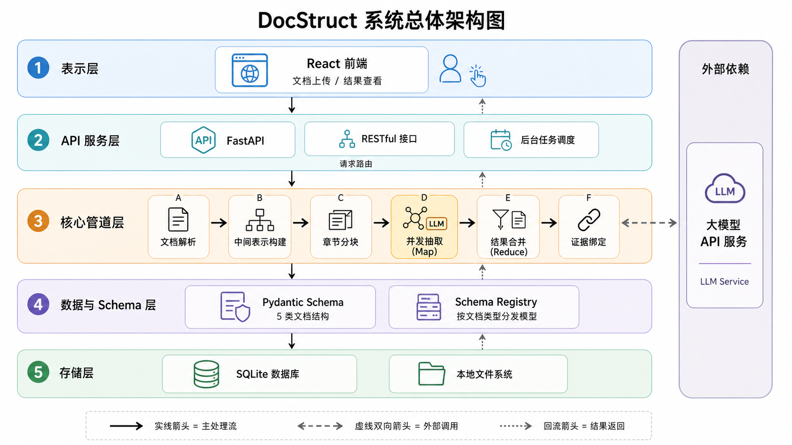
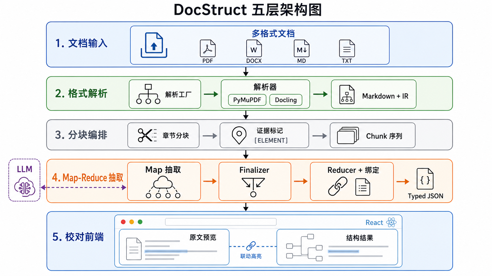
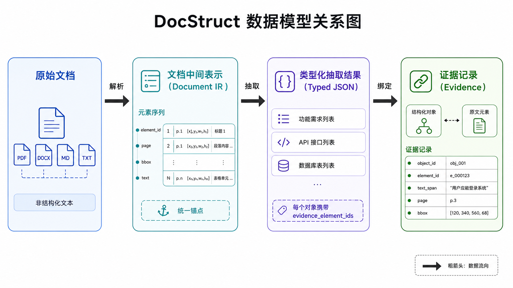
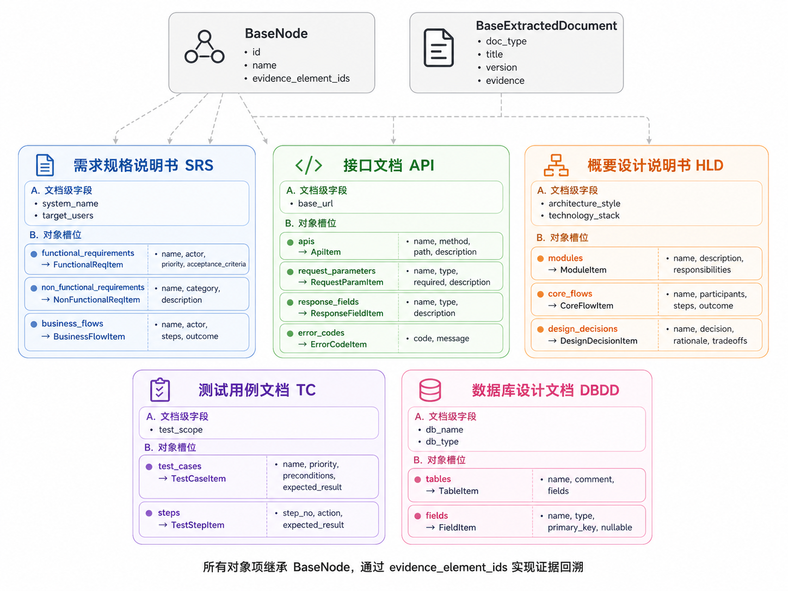
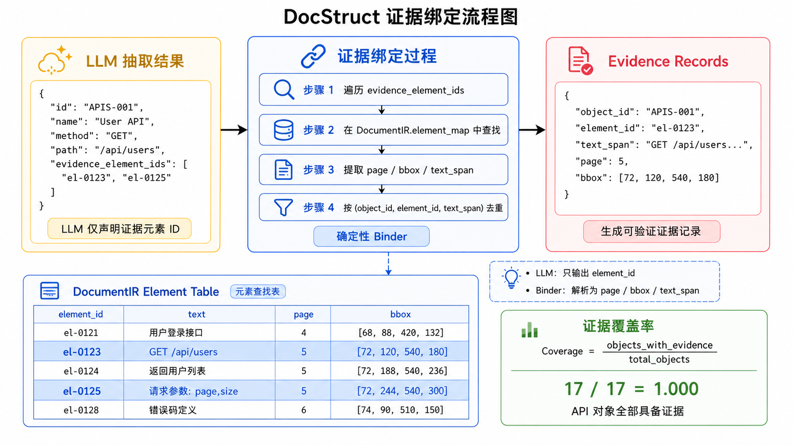

本科毕业设计（论文）

**基于大模型的软件工程文档内容结构化提取系统设计与实现**

| **学院**     |   **软件学院**   |
|--------------|:----------------:|
| **专业**     |   **软件工程**   |
| **学生姓名** |    **陈大钧**    |
| **学生学号** | **202230480076** |
| **指导教师** |    **陈春华**    |
| **提交日期** | **2026年5月6日** |

华南理工大学

学位论文原创性声明

本人郑重声明：所呈交的论文是本人在导师的指导下独立进行研究所取得的研究成果。除了文中特别加以标注引用的内容外，本论文不包含任何其他个人或集体已经发表或撰写的成果作品。对本文的研究做出重要贡献的个人和集体，均已在文中以明确方式标明。本人完全意识到本声明的法律后果由本人承担。

作者签名： 日期： 年 月 日

学位论文版权使用授权书

本学位论文作者完全了解学校有关保留、使用学位论文的规定，即：学校有权保存并向国家有关部门或机构送交论文的复印件和电子版，允许学位论文被查阅；学校可以公布学位论文的全部或部分内容，可以允许采用影印、缩印或其它复制手段保存、汇编学位论文。本人电子文档的内容和纸质论文的内容相一致。

作者签名： 日期： 年 月 日

指导教师签名： 日期： 年 月 日

# 摘 要

软件工程文档包含需求规格、接口定义、概要设计、测试用例和数据库设计等关键信息，是软件系统分析、开发、测试和维护的重要依据。实际项目中，此类文档常以 PDF、DOCX、Markdown 或纯文本形式保存，格式差异大、结构层次不稳定，难以直接转换为可计算的结构化数据。针对这一问题，本文设计并实现了基于大语言模型的软件工程文档内容结构化提取系统 DocStruct。系统面向单文档级抽取场景，支持多格式文档上传，覆盖需求规格说明书、API 接口文档、概要设计说明书、测试用例文档和数据库设计文档五类主干软件工程文档。系统采用 Parser 多格式解析、Document IR 统一中间表示、章节感知分块、Map 并发抽取、Finalizer/Reducer 二级合并和证据绑定的处理流程，将非结构化文档转化为带证据回溯的 typed JSON。后端基于 FastAPI、Pydantic v2 和 SQLite 实现，前端基于 React 19、TypeScript 和 Tailwind CSS 实现，支持文档上传、结构化结果查看、原文对照和 PDF 证据定位。实验部分基于 6 份中文软件工程文档构建人工标注数据集，设计离线评测框架，在 DeepSeek-V4-Flash 模型上整体 F1 达到 0.908，API 文档和功能需求抽取 F1 达到 1.000。通过与 qwen-doc-turbo 和 kimi-k2.5 的对比实验，选择 DeepSeek-V4-Flash 作为系统默认模型。结果表明，DocStruct 能够有效完成中短软件工程文档的结构化抽取，在保证较高精度的同时提供了可解释的证据回溯能力。

关键词：大语言模型；软件工程文档；结构化抽取；文档解析；证据回溯

# Abstract

Software engineering documents contain key information such as requirements specifications, API definitions, architecture designs, test cases, and database schemas. In real projects, these documents are often stored as PDF, DOCX, Markdown, or plain text files with inconsistent formats and unstable structures, making them difficult to convert into computable data. To address this problem, this thesis designs and implements DocStruct, an LLM-based structured content extraction system for software engineering documents. DocStruct focuses on single-document extraction, supports multiple input formats, and covers five major document types: software requirements specifications, API documents, high-level design documents, test case documents, and database design documents. The system follows a pipeline of multi-format parsing, unified Document IR construction, section-aware chunking, concurrent Map extraction, Finalizer/Reducer two-stage merging, and evidence binding, converting unstructured documents into typed JSON with traceable evidence. The backend is implemented with FastAPI, Pydantic v2, and SQLite, while the frontend is implemented with React 19, TypeScript, and Tailwind CSS. Using a manually annotated dataset of six Chinese software engineering documents and an offline evaluation framework, the system achieves an overall F1 of 0.908 with DeepSeek-V4-Flash, with API documents and functional requirements reaching F1=1.000. Model comparison experiments with qwen-doc-turbo and kimi-k2.5 confirm DeepSeek-V4-Flash as the default system model. The results indicate that DocStruct can effectively extract structured information from medium and short software engineering documents, providing both high precision and interpretable evidence traceability.

Keywords: Large Language Model; Software Engineering Document; Structured Extraction; Document Parsing; Evidence Traceability

# 目 录

[摘 要](#摘-要)

[Abstract](#abstract)

[目 录](#目-录)

[第一章 绪论](#第一章-绪论)

> [1.1 研究背景](#11-研究背景)
>
> [1.2 国内外研究现状](#12-国内外研究现状)
>
> [1.3 相关技术基础](#13-相关技术基础)
>
> [1.4 本文工作](#14-本文工作)
>
> [1.5 论文结构](#15-论文结构)

[第二章 需求分析](#第二章-需求分析)

> [2.1 系统目标](#21-系统目标)
>
> [2.2 功能需求](#22-功能需求)
>
> [2.3 非功能需求](#23-非功能需求)

[第三章 系统设计](#第三章-系统设计)

> [3.1 总体架构](#31-总体架构)
>
> [3.2 数据模型设计](#32-数据模型设计)
>
> [3.3 抽取契约设计](#33-抽取契约设计)
>
> [3.4 分块策略设计](#34-分块策略设计)
>
> [3.5 合并与证据绑定设计](#35-合并与证据绑定设计)
>
> [3.6 接口设计](#36-接口设计)

[第四章 系统实现与测试](#第四章-系统实现与测试)

> [4.1 技术栈总览](#41-技术栈总览)
>
> [4.2 后端架构与接口](#42-后端架构与接口)
>
> [4.3 文档解析与中间表示](#43-文档解析与中间表示)
>
> [4.4 结构化抽取流水线](#44-结构化抽取流水线)
>
> [4.5 Schema 与类型系统](#45-schema-与类型系统)
>
> [4.6 前端实现](#46-前端实现)
>
> [4.7 功能测试](#47-功能测试)
>
> [4.8 离线评测与模型选择](#48-离线评测与模型选择)
>
> [4.9 本章小结](#49-本章小结)

[第五章 结论](#第五章-结论)

> [5.1 工作总结](#51-工作总结)
>
> [5.2 主要特点](#52-主要特点)
>
> [5.3 不足与展望](#53-不足与展望)

[参考文献](#参考文献)

[致谢](#致谢)

# 第一章 绪论

## 1.1 研究背景

软件工程项目依赖多种文档：需求规格说明书记录系统目标和功能约束，API 文档描述接口路径和参数，概要设计文档说明模块划分和架构风格，测试用例文档用于验证功能正确性，数据库设计文档保存表结构和字段关系。这些文档通常由不同人员在项目不同阶段编写，格式和表达方式不统一，关键信息常以自然语言、表格或混合格式嵌入文本，程序难以直接读取。

从非结构化文档中识别需求本身是耗时且容易出错的任务[1]。在线 API 文档缺乏统一结构，人工转换为 OpenAPI 规范的成本较高[2]。软件配置信息散布于说明、手册和讨论材料中，缺少统一组织[3]。PDF 等版式文档还带来额外的解析困难——电子文档中的文本并非总能按阅读顺序直接获取[4]。

大语言模型在语义理解和结构化输出方面的进展为文档自动解析提供了新的技术手段，但仅靠大模型一次性生成，容易出现编造、遗漏或格式错误。如何将大模型能力与确定性工程流程结合，是本文的核心关注点。

## 1.2 国内外研究现状

需求工程方面，Ivanov 等基于 PURE 数据集使用 BERT 对需求和非需求句子进行分类[1]，ReqFusion 进一步验证了结构化提示对需求抽取质量的影响[10]。这类方法以句子或需求项为单位，与本文面向多类型文档的 typed JSON 抽取有差异。

API 文档结构化方面，OASBuilder 将在线 HTML 文档转化为 OpenAPI 规范，通过文档抓取、操作分段、并行 LLM 调用和人工校验的流程，体现了规则流程与大模型结合的工程思路[2]。SpecSyn 使用大模型从自然语言来源合成软件配置规范，较既有方法在 F1 上有提升[3]。

文档解析方面，文档智能领域已建立版面分析和信息抽取的基准数据集[13]；Docling 支持 PDF 转 Markdown/JSON 及布局分析和表格识别[5]；MinerU2.5 则从高分辨率解析角度提出解耦视觉语言模型[9]。LLM×MapReduce 提出将长序列拆分为子任务并聚合的免训练框架[6]，与本文分块抽取、全局合并的思路一致。在结果评估方面，ALCE 从流畅性、正确性和引用质量评估带引用生成[7]，Ragas 关注检索增强生成中的忠实度评估[8]，Core 从信息性子声明角度提升事实精度评分鲁棒性[11]。检索增强生成研究也表明将生成结果与上下文证据结合有助于提升知识密集型任务的可验证性[12]。

## 1.3 相关技术基础

大语言模型。 本文使用大语言模型处理软件工程文档中的局部语义识别——从需求段落中抽取功能需求，从接口文档中识别路径和请求方法，从数据库设计中提取表和字段信息。

文档格式与解析。 软件工程文档常见格式包括 PDF、DOCX、Markdown 和 TXT。Markdown 与 TXT 可直接读取，DOCX 需解析段落和表格，PDF 涉及版面分析、文本层和坐标信息。DocStruct 通过 ParserFactory 按扩展名选择解析器，将不同格式统一转换为 Document IR[5]。

Document IR。 Document IR 是系统内部的文档中间表示，将原始文档转化为元素列表、章节大纲和元数据。每个元素包含 element_id、文本内容、页码、bbox、章节路径和阅读顺序。IR 既是分块输入，也是证据绑定的数据来源。

结构化抽取。 本文采用 Pydantic 定义各类文档的 typed schema，相比通用 JSON 生成具有更强的字段约束，不同文档类型的抽取逻辑可复用。

Map-Reduce 流程。 系统按章节边界将文档拆分为多个 chunk，对每个 chunk 并发调用大模型进行局部抽取，再将候选结果合并为全局结果[6]。

## 1.4 本文工作

本文围绕 DocStruct 系统完成以下工作：

1. 为五类软件工程文档设计 typed schema，覆盖需求、接口、概要设计、测试用例和数据库设计。
2. 构建 Parser 到 Document IR 的解析层，将不同格式统一为包含元素、章节和位置锚点的中间表示。
3. 设计章节感知分块和 Map-Reduce 抽取流程，使用 asyncio.Semaphore 控制并发。
4. 实现证据绑定机制，将结构化对象与原文元素关联，支持前端对照查看和 PDF 位置定位。
5. 构建 FastAPI 后端和 React 前端，完成文件上传、后台处理和结构化结果展示。
6. 建立人工标注数据集和离线评测脚本，通过模型对比实验选择 DeepSeek-V4-Flash 作为默认模型。

## 1.5 论文结构

本文共五章。第一章介绍研究背景、国内外研究现状、相关技术基础和本文工作。第二章给出系统需求分析。第三章说明系统总体设计、数据模型和处理流程。第四章描述系统实现细节并给出测试与评测结果。第五章总结工作并讨论不足与改进方向。

# 第二章 需求分析

## 2.1 系统目标

软件工程项目中常见的文档包括需求规格说明书、API 接口文档、概要设计说明书、测试用例文档和数据库设计文档。这些文档通常以 PDF、DOCX、Markdown 等形式保存，部分情况下也可能以纯文本形式存在。前几类格式更贴近实际软件工程文档的主要载体，而纯文本主要作为系统兼容未知或简化输入场景的兜底格式。

DocStruct 面向单文档级结构化抽取场景，目标是接收用户上传的软件工程文档，完成文档解析、结构化抽取、结果合并和证据回溯，最终输出可被程序读取和人工核查的 typed JSON。系统不定位为通用问答系统，也不涉及跨文档知识库、向量检索、URL 爬取和多模型在线切换。

系统覆盖的核心文档类型如下表所示。

**表 2-1 系统支持的文档类型**

| 文档类型       | 类型标识 | 主要抽取内容                                     |
| -------------- | -------- | ------------------------------------------------ |
| 需求规格说明书 | srs      | 功能需求、非功能需求、业务流程、目标用户等       |
| API 接口文档   | api      | 接口路径、请求方法、请求参数、响应字段、错误码等 |
| 概要设计说明书 | hld      | 模块、核心流程、设计决策等                       |
| 测试用例文档   | tc       | 测试用例、前置条件、测试步骤、预期结果等         |
| 数据库设计文档 | dbdd     | 数据表、字段、主键、外键、约束等                 |
| 未知类型文档   | unknown  | 仅保留原文与 Document IR，不执行结构化抽取       |

## 2.2 功能需求

系统功能需求可按用户操作链路和后端处理链路划分，如表 2-2 所示。

**表 2-2 系统功能需求**

| 功能模块     | 功能说明                                                     |
| ------------ | ------------------------------------------------------------ |
| 文档上传     | 支持用户上传软件工程文档，并指定文档类型。                   |
| 类型管理     | 支持 srs、api、hld、tc、dbdd、unknown 等文档类型，并根据类型选择对应抽取规则。 |
| 多格式解析   | 支持 PDF、DOCX、Markdown 等常用格式，TXT 仅作为兜底输入格式。 |
| 中间表示构建 | 将原文转换为统一的 Document IR，为后续分块、抽取和证据绑定提供基础。 |
| 摘要生成     | 调用大语言模型生成文档摘要，辅助理解文档主题和主要内容。     |
| 章节感知分块 | 按章节结构和内容边界切分文档，降低长文档抽取难度。           |
| 结构化抽取   | 根据文档类型调用对应 typed schema，抽取高价值结构化字段。    |
| 结果合并     | 合并多个分块的抽取结果，完成去重和全局编号。                 |
| 证据绑定     | 将抽取结果与原文元素关联，支持结果来源回溯。                 |
| 结果查看     | 前端展示原文、摘要、结构化结果和证据内容。                   |
| 结果修订     | 支持用户修改原文、摘要和结构化抽取结果。                     |
| 调试与重试   | 支持查看分块调试信息，并对已有文档重新执行抽取。             |

## 2.3 非功能需求

系统非功能需求主要包括抽取准确、结果可追溯、系统稳定、易于扩展和使用方便等方面，如表 2-3 所示。

**表 2-3 系统非功能需求**

| 需求类别 | 需求说明                                                     |
| -------- | ------------------------------------------------------------ |
| 正确性   | 抽取结果应符合对应文档类型的 typed schema，减少字段混乱和格式错误。 |
| 稳定性   | 单个分块抽取失败时，系统应保留其他有效结果，避免整体流程中断。 |
| 可追溯性 | 结构化结果应尽量关联原文证据，便于用户核查来源。             |
| 可解释性 | 用户应能够查看抽取结果对应的原文内容，PDF 文档支持页面定位和高亮。 |
| 可维护性 | 新增文档类型时，应尽量通过注册 schema 完成，减少对核心流程的修改。 |
| 扩展性   | 文档解析、分块、抽取、合并和证据绑定等模块应保持相对独立。   |
| 性能     | 系统应通过长度限制、分块处理和并发抽取，提高中短文档处理效率。 |
| 易用性   | 上传、查看、筛选、修订和重试流程应清晰直观，降低用户操作成本。 |

## 2.4 输入格式需求

DocStruct 支持多种文档输入格式。系统以 PDF、DOCX 和 Markdown 作为主要支持格式，TXT 仅作为兜底格式，用于兼容简单文本或异常输入场景，如表 2-4 所示。

**表 2-4 输入格式支持说明**

| 输入格式 | 支持说明                                                     |
| -------- | ------------------------------------------------------------ |
| PDF      | 常见的软件工程文档交付格式，适合保留页码、版面和证据定位信息。 |
| DOCX     | 常见的软件工程文档编写与交付格式，能够保留段落、标题和表格等结构。 |
| Markdown | 常见的开发文档格式，标题、列表、代码块等结构清晰，便于解析。 |
| TXT      | 兜底输入格式，仅保留纯文本内容，缺少章节、表格和版面信息。   |

# 第三章 系统设计

## 3.1 总体架构

DocStruct 采用前后端分离架构。后端分五层：存储层（SQLite + 文件系统）、数据层（Pydantic v2 + Schema Registry + Tortoise ORM）、核心管道层（Parser / IR Builder / Chunker / Extractor / Finalizer-Reducer / Evidence Binder）、API 服务层（FastAPI，8 个 RESTful 接口）和外部 LLM 服务层。

系统主流程：上传后 Parser 产出 Markdown 和 Document IR → LLM 生成摘要 → Chunker 按章节边界分块 → Extractor 并发调用 LLM 逐块抽取（Map）→ Finalizer/Reducer 去重合并（Reduce）→ Evidence Binder 关联原文 → 结果入库并返回前端。

## 3.2 数据模型设计

系统数据模型分四层：文档记录、Document IR、抽取类型系统和 Evidence 记录。

文档记录。 Tortoise ORM 映射到 SQLite，字段包括 id、title、doc_type、status（pending/processing/completed/failed）、file_path、raw_text、summary、document_ir（JSON）和 extracted_data（JSON）。created_at/updated_at 由 ORM 维护。修改 raw_text 时自动清除旧 IR。

Document IR。 解析后的统一中间表示，核心结构为元素列表和章节大纲。每个元素 DocumentElement 包含 element_id（全局递增，如 el-0001）、element_type、markdown、text、page、bbox、reading_order 和 section_path。element_id 是分块标注、LLM 证据引用和证据绑定的统一锚点。章节大纲以嵌套结构记录各章标题及起止元素 ID。

抽取类型系统。 基于 Pydantic v2 三层继承。BaseNode 定义 id、name 和 evidence_element_ids；BaseExtractedDocument 定义 doc_type、title、version、summary 和全局 evidence 列表。五类文档的具体模型通过多重继承组合。以 SRS 为例：FunctionalReqItem（name、points、actor、priority、category、acceptance_criteria）、NonFunctionalReqItem（name、category、description）和 BusinessFlowItem（name、actor、steps、outcome）。API 文档的 ApiItem 包含 method、path、request_parameters、response_fields 和 error_codes。HLD 文档包含 ModuleItem、CoreFlowItem 和 DesignDecisionItem。字段中使用 field_validator 将中文枚举值（"高"/"中"/"低"）归一化为英文枚举，减少 LLM 输出差异导致的校验失败。

Evidence 记录。 连接对象与原文，每条含 object_id、element_id、text_span（截取前 500 字符）、page 和 bbox。

## 3.3 抽取契约设计

ExtractionContract 由 response_model 动态生成，将"抽取什么"与"如何抽取"解耦。契约包含：文档级标量字段（system_name、base_url 等）；对象槽位列表（functional_requirements、apis 等）；通用规则（只抽取原文已存在对象、evidence_element_ids 须来自当前块允许列表、未出现槽位返回空列表、禁止编造数据）；忽略章节列表（参考文献、术语表、附录等）。新增文档类型时只需定义 Pydantic 模型并注册，契约自动生成，管道代码复用。

## 3.4 分块策略设计

采用章节感知分块，以 Document IR 的章节边界为参考面，优先在章节内部切分。算法：遍历元素列表，按章节路径归入单元组（忽略章节直接跳过）；在组内沿元素顺序累加至超过 max_chars（默认 5000）；单个超大元素沿边界拆分。相邻块间保留 200 字符重叠窗口——从前一块尾部逆向选取元素前置到当前块头部，恢复跨块边界语义上下文。

分块内容渲染时，每个元素前插入 [ELEMENT: el-0123 page=5] 标记，作为 LLM 声明证据引用的 ID 锚点。同时传入 allowed_evidence_element_ids 列表，严格限定 LLM 只能引用当前可见元素。

## 3.5 合并与证据绑定设计

两级合并策略：LLM Finalizer → 确定性 Reducer（Fallback）。

Finalizer 设计约束：不读完整原文（只收大纲、摘要、契约和块候选），要求 LLM 去重、保留 evidence_element_ids、维持层次结构、禁止引入新事实。失败时回退 Reducer。

Reducer 执行流程：动态发现槽位（遍历 response_model 类型注解，检查 __origin__ 是否为 list）→ 文档级字段按类型合并（字符串取长不取空，列表去重）→ 对象槽位按身份键去重。身份键层级：name + 类型字段（如 entity_type、method）优先，LLM 分配的 id 次之，JSON 序列化兜底。匹配后按字段级合并：字典递归，列表去重追加，字符串取长。合并完成后分配全局 ID（前缀由槽位名映射：FREQ/NFR/APIS/MOD/TC/TBL + 数字序号）。

证据绑定阶段读取 evidence_element_ids，仅保留 IR 中实际存在的元素 ID，生成 evidence 记录。计算 evidence coverage（有证据对象数 / 总对象数）作为置信度近似指标。

## 3.6 接口设计

表 3-1 后端接口

| 方法 | 路径 | 说明 |
| --- | --- | --- |
| POST | /api/upload | 上传文件，后台触发处理流水线 |
| GET | /api/documents | 文档列表（支持状态和类型筛选） |
| GET | /api/documents/{id} | 文档详情（含 extracted_data 和 evidence） |
| PATCH | /api/documents/{id} | 修订 raw_text/summary/extracted_data |
| DELETE | /api/documents/{id} | 删除记录与文件 |
| GET | /api/documents/{id}/chunks | 分块调试数据 |
| POST | /api/documents/{id}/retry-extraction | 重新执行抽取 |
| GET | /api/documents/{id}/file | 下载原始文件 |

上传接口通过 BackgroundTasks 异步化，请求快速返回文档 ID，前端轮询状态。接口数据格式 JSON，字段命名 camelCase（Pydantic alias_generator 自动转换），数据库 snake_case。

# 第四章 系统实现与测试

## 4.1 技术栈总览

DocStruct 前后端技术选型如表 4-1 所示。

**表 4-1 系统技术栈**

| 层级 | 技术选型 | 用途 |
|------|----------|------|
| 后端框架 | FastAPI | RESTful API 服务，支持 asyncio 异步 |
| 数据校验 | Pydantic v2 | typed schema 定义与输入输出校验 |
| ORM | Tortoise ORM + SQLite | 文档记录持久化 |
| 文档解析 | PyMuPDF / python-docx / Docling | PDF、DOCX、Markdown 解析 |
| LLM 调用 | OpenAI Compatible API | 结构化抽取与摘要生成 |
| 前端框架 | React 19 + TypeScript | 单页应用 |
| 样式 | Tailwind CSS 4 + shadcn/ui | 界面样式与基础组件 |
| 状态管理 | TanStack Query v5 | 服务端数据缓存与自动轮询 |
| PDF 渲染 | pdfjs-dist | PDF 页面渲染与视口坐标映射 |
| Markdown 渲染 | ReactMarkdown | GFM / KaTeX / 代码高亮 |
| 代码编辑器 | CodeMirror 6 | JSON 编辑与对象定位 |
| 构建工具 | Vite 8 | 前端构建与开发服务器 |

## 4.2 后端架构与接口

后端入口 `main.py` 启动时完成 CORS 配置、Tortoise ORM 注册和上传目录创建。运行参数通过环境变量注入，如表 4-2 所示。

**表 4-2 后端运行参数**

| 环境变量 | 默认值 | 说明 |
|----------|--------|------|
| `LLM_BASE_URL` | — | OpenAI 兼容 API 地址 |
| `LLM_MODEL` | `qwen-doc-turbo` | 默认抽取模型 |
| `EXTRACTION_CHUNK_MAX_CHARS` | 5000 | 单块最大字符数 |
| `EXTRACTION_CONCURRENCY` | 3 | Map 阶段并发上限 |

8 个 RESTful 接口已在 3.6 节详述，覆盖上传、列表、详情、修订、下载、调试和重试。上传接口通过 `BackgroundTasks` 异步化——请求返回文档 ID 后，后台流水线按序执行解析→摘要→抽取→证据绑定，各阶段完成时更新数据库状态，前端轮询获取进度。

## 4.3 文档解析与中间表示

`ParserFactory.get_parser()` 按文件扩展名调度解析器，如表 4-3 所示。

**表 4-3 解析器调度**

| 格式 | 解析器 | 核心依赖 | 说明 |
|------|--------|----------|------|
| PDF | PdfParser | PyMuPDF | 自动 OCR 检测；提取文本与坐标 |
| PDF/DOCX | DoclingParser | Docling | 可选后端，提供版面分析、表格识别与 bbox 坐标 |
| DOCX | DocxParser | python-docx | 识别段落、标题层级、表格和列表 |
| Markdown/TXT | PlainTextParser | — | 直接读取，经 MarkdownNormalizer 规范化 |

各解析器输出统一 `ParseResult`（Markdown + `DocBlock` 列表），由 `parse_result_to_ir()` 构建 Document IR——系统的核心中间表示。IR 构建过程维护标题栈：遇标题时截断栈至当前层级减一后追加，非标题元素自动继承当前章节路径（如 `["第三章", "3.1 接口定义"]`）。每个元素分配全局递增 `element_id`（如 `el-0001`），作为分块标注和证据引用的统一锚点。对于 SRS 文档，额外过滤"需求编号""验收标准"等字段标签以防止误判为章节边界。IR 核心结构如表 4-4 所示。

**表 4-4 Document IR 核心结构**

| 结构 | 关键字段 | 用途 |
|------|----------|------|
| `DocumentElement` | element_id, element_type, text, markdown, section_path, page, bbox, order | 原子级文档元素 |
| `DocumentOutline` | title, doc_type, sections, main_topics | 章节大纲，注入 LLM 提示词 |
| `DocumentIR` | title, doc_type, elements, outline | 完整的中间表示 |

## 4.4 结构化抽取流水线

抽取流水线按表 4-5 所示六阶段执行，覆盖从原始文档到带证据的 typed JSON 的完整链路。

**表 4-5 抽取流水线阶段**

| 阶段 | 职责 | LLM 调用 | 可回退 |
|------|------|:------:|:------:|
| 1. 契约构建 | 从 response_model 动态生成 ExtractionContract（目标槽位 + 规则 + 忽略章节列表） | — | — |
| 2. 章节感知分块 | 按章节边界切分 IR 元素，过滤参考文献/术语表/附录，块间 200 字符重叠 | — | — |
| 3. Map 并发抽取 | 每块并发调用 LLM，asyncio.Semaphore(3) 控制并发，抽取局部候选对象 | ✓ | 单块失败不影响整体 |
| 4. Finalizer 合并 | LLM 去重合并跨块候选，不读原文、不引入新事实 | ✓ | 回退 Reducer |
| 5. Reducer（Fallback） | 确定性按身份键去重 → 字段级合并 → 全局 ID 分配，零 LLM 调用 | — | — |
| 6. 证据绑定 | 遍历 evidence_element_ids，匹配 IR 元素生成 evidence 记录 | — | — |

分块策略参数如表 4-6 所示。算法按章节路径分组元素，组内沿元素顺序累加至 `max_chars` 后切分；超大单元沿元素边界拆分。相邻块间从前块尾部逆向选取元素注入当前块头部，恢复跨块语义上下文。

**表 4-6 分块参数**

| 参数 | 默认值 | 说明 |
|------|--------|------|
| max_chars | 5000 | 单块最大字符数 |
| overlap_chars | 200 | 相邻块重叠窗口（逆向选取前块尾部元素） |
| 并发数 | 3 | asyncio.Semaphore 控制 |

分块内容渲染时，每个元素前插入 `[ELEMENT: el-0123 page=5]` 标记作为 LLM 引用锚点，同时传入 `allowed_evidence_element_ids` 列表严格限定引用范围。LLM 提示词含六部分：系统提示、文档大纲、文档摘要、抽取契约、分块元数据和带标记的渲染 Markdown。LLM 响应后经 JSON 清洗（去 Markdown 代码块包裹、修复尾随逗号）和 Pydantic 校验。

合并阶段：Finalizer 为一次追加 LLM 调用，接收大纲、摘要、契约和所有块候选，负责去重合并但禁止引入新事实。若失败回退 Reducer——通过 response_model 类型注解动态发现 list 类型槽位（`__origin__` 检查），文档级标量字段取长不取空，对象槽位按身份键去重（优先级：name + 类型字段 → LLM id → JSON 序列化兜底）。合并后按槽位映射前缀分配 `FREQ-001`、`APIS-001`、`TC-001` 等全局 ID。

证据绑定遍历每个对象的 `evidence_element_ids`，在 IR 元素映射中仅保留实际存在的 ID。每条 evidence 含 object_id、element_id、text_span（截取前 500 字符）、page 和 bbox，经 `(object_id, element_id, text_span)` 三元组去重。以 evidence coverage（有证据对象数 / 总对象数）作为置信度近似指标。

## 4.5 Schema 与类型系统

系统采用 Pydantic v2 三层继承定义五类文档的 typed schema，如表 4-7 所示。

**表 4-7 Schema 继承层次**

| 层级 | 基类 | 核心字段 |
|------|------|----------|
| 基础对象 | `BaseNode` | id, name, evidence_element_ids |
| 基础文档 | `BaseExtractedDocument` | doc_type, title, version, evidence |
| 领域容器 | `SrsExtraction` / `ApiExtraction` 等 | 各文档类型的槽位字段 |
| 最终模型 | `SrsExtractedDocument` 等 | 领域容器 + BaseExtractedDocument 多重继承 |

五类文档的槽位定义如表 4-8 所示。各对象模型使用 `field_validator` 将中文枚举值（"高"/"中"/"低"）归一化为英文枚举，减少 LLM 输出差异导致的校验失败。

**表 4-8 五类文档 Schema 槽位**

| 文档类型 | 标识 | 主要槽位 | 关键对象模型 |
|----------|------|----------|--------------|
| 需求规格说明书 | srs | functional_requirements, non_functional_requirements, business_flows | FunctionalReqItem, NonFunctionalReqItem, BusinessFlowItem |
| API 接口文档 | api | apis | ApiItem（含 method, path, request_parameters, error_codes） |
| 概要设计说明书 | hld | modules, core_flows, design_decisions | ModuleItem, CoreFlowItem, DesignDecisionItem |
| 测试用例文档 | tc | test_cases | TestCaseItem（含 preconditions, steps, expected_result） |
| 数据库设计文档 | dbdd | tables | TableItem（含 fields: name, type, primary_key, nullable） |

`Schema Registry` 通过 `TYPED_MODEL_MAP: dict[DocType, type[BaseModel]]` 维护文档类型到 Pydantic 模型的映射。`normalize_doc_type()` 将输入规范化为枚举（非法值回退 `UNKNOWN`），`get_response_model()` 返回对应模型。新增文档类型只需定义 `XxxExtraction` + `XxxExtractedDocument` 并注册映射，核心管道代码无需修改。

## 4.6 前端实现

前端单页布局：左侧 280px 侧边栏（文档列表 + 搜索筛选 + 拖放上传区），右侧主区域（文档详情 + 抽取结果）。核心组件职责如表 4-9 所示。

**表 4-9 前端核心组件**

| 组件 | 职责 |
|------|------|
| `DocSidebar` | 文档列表展示，支持标题搜索和状态/类型筛选 |
| `UploadZone` | 拖放/点击上传，自动过滤 .pdf/.docx/.md/.txt 扩展名 |
| `DocTypeSelectorDialog` | 上传时文档类型选择（5 种类型卡片网格） |
| `DocPreviewPanel` | 详情页总控：原文查看器 + 抽取结果面板 + JSON/Markdown sheet 修订 |
| `ExtractionResultPanel` | 结构化结果按槽位分组展示，支持折叠、逐字段编辑和证据跳转 |
| `JsonCodeEditor` | CodeMirror 6 JSON 编辑器，支持语法校验和按对象 ID 自动定位 |
| `PdfEvidenceViewer` | pdf.js 渲染，bbox 坐标经视口映射为可点击覆盖层 |
| `DocxEvidenceViewer` | 基于 IR 元素渲染 DOCX 结构，element_id 级证据高亮 |
| `MarkdownEvidenceViewer` | ReactMarkdown 渲染 + `useTextEvidence` 钩子实现 DOM 文本节点 `<mark>` 标记 |
| `ChunkDebugPanel` | 分块调试视图（独立页面），展示每块的章节路径、元素列表和渲染内容 |

证据可视化按文件格式分派不同策略，如表 4-10 所示。各查看器统一向上层暴露 `onSelectEvidence` 回调，使抽取结果面板无需感知底层格式差异。

**表 4-10 证据可视化策略**

| 文件类型 | 查看器 | 证据定位方式 |
|----------|--------|--------------|
| PDF | PdfEvidenceViewer | bbox 坐标 → 视口坐标映射 → 可点击覆盖层按钮 |
| DOCX | DocxEvidenceViewer | element_id 匹配 IR 元素 → 元素级高亮标注 |
| Markdown | MarkdownEvidenceViewer | text_span → DOM 文本节点索引 → `<mark>` 包裹 |
| 纯文本 | PlainTextEvidenceViewer | text_span → `<pre>` 内文本节点 → `<mark>` 包裹 |

状态管理基于 TanStack Query v5。文档处于处理中状态时列表和详情每 2 秒轮询，完成后自动停止。Mutations 通过 `setQueryData` 即时更新缓存。前端提供 raw_text/summary/extracted_data 修订功能——raw_text 变化时自动清除旧 IR 触发重新解析；extracted_data 支持 JSON 编辑器整体编辑和对象级字段编辑。

## 4.7 功能测试

功能测试覆盖系统主流程和边界场景，验证各模块协作的正确性。10 项测试用例全部通过，如表 4-11 所示。

**表 4-11 功能测试用例及结果**

| 编号 | 测试项 | 预期行为 | 结果 |
| --- | --- | --- | --- |
| T1 | 上传 PDF/DOCX/MD/TXT 文件 | 生成文档记录并进入后台处理，状态从 pending → processing → completed | 通过 |
| T2 | 指定 srs/api/hld/tc/dbdd 类型上传 | 系统选择对应 typed schema 执行结构化抽取 | 通过 |
| T3 | 指定 unknown 类型上传 | 仅保留原文和 IR，不执行结构化抽取 | 通过 |
| T4 | 查看文档列表和详情 | 前端展示文档状态、原文、摘要和抽取结果 | 通过 |
| T5 | 查看 chunks 调试数据 | 返回各分块的 section_path、element_ids 和 markdown 内容 | 通过 |
| T6 | PATCH 修订 raw_text/extracted_data | 修订后数据持久化；raw_text 变化时自动清除旧 IR | 通过 |
| T7 | 删除文档 | 数据库记录和上传文件被同步删除 | 通过 |
| T8 | PDF 证据定位 | 有 bbox 时点击结构化对象可定位至 PDF 对应页面和区域 | 通过 |
| T9 | 超长文档输入（>100000 字符） | 返回明确错误信息，不进入抽取流程 | 通过 |
| T10 | 重试抽取 | 对已完成文档重新执行结构化抽取，覆盖旧结果 | 通过 |

以上测试覆盖了从文档上传、类型选择、自动处理、结果查看到人工修订和证据定位的核心用户路径。

## 4.8 离线评测与模型选择

### 4.8.1 评测框架与数据集

项目提供 `scripts/evaluate.py` 离线评测脚本，支持两种模式：离线模式读取 `experiments/results/cached` 中的缓存抽取结果快速复现；在线模式通过 `--live` 参数实时调用 LLM 抽取。评测支持单文档（`--doc` + `--gt`）和批量（`--manifest`）两种方式。

评测数据集包含 6 份中文软件工程文档样本，每份文档有对应的人工标注 Ground Truth JSON，如表 4-12 所示。

**表 4-12 评测数据集**

| 文档 | 类型 | GT 对象数 | 说明 |
| --- | --- | ---: | --- |
| experiments/assets/srs_mini.pdf | srs | 18 | 短篇需求规格说明书，含功能需求、非功能需求和目标用户 |
| static/examples/srs_example.md | srs | 52 | 中篇需求规格说明书，含完整业务流程 |
| experiments/assets/api_mini.md | api | 3 | 短篇 API 文档 |
| static/examples/api_example.md | api | 17 | 中篇 API 文档，含请求参数和错误码 |
| static/examples/test_case_example.md | tc | 10 | 测试用例文档 |
| experiments/assets/design_mini.md | hld | 8 | 概要设计文档，含模块、流程和设计决策 |

评测以 typed schema 为口径，动态发现 GT 和预测结果中的 list 类型槽位，按槽位计算匹配指标。对象匹配采用名称词级 bigram Jaccard 相似度、子串包含优先和类型字段模糊权重相结合的贪心匹配算法（阈值 0.3）。API 对象优先按 HTTP 方法和路径精确匹配，普通对象使用归一化名称加类型权重综合匹配，括号后缀（如"（SRS-USER-001）"）在匹配前自动剥离。

### 4.8.2 整体评测结果

使用 DeepSeek-V4-Flash 作为抽取模型，在 6 份文档上的评测结果如表 4-13 所示。

**表 4-13 各文档评测结果汇总**

| 文档 | 类型 | Precision | Recall | F1 | TP | FP | FN |
| --- | --- | ---: | ---: | ---: | ---: | ---: | ---: |
| api_mini | api | 1.000 | 1.000 | 1.000 | 3 | 0 | 0 |
| api_example | api | 1.000 | 1.000 | 1.000 | 17 | 0 | 0 |
| srs_mini | srs | 1.000 | 0.611 | 0.759 | 11 | 0 | 7 |
| srs_example | srs | 0.955 | 0.808 | 0.875 | 42 | 2 | 10 |
| design_mini | hld | 0.875 | 0.875 | 0.875 | 7 | 1 | 1 |
| test_case_example | tc | 0.900 | 0.900 | 0.900 | 9 | 1 | 1 |
| **总计** | — | **0.957** | **0.864** | **0.908** | **89** | **4** | **19** |

整体 F1 达到 0.908，Precision 总体较高（0.957），表明模型输出质量较好，几乎不存在编造对象的问题。API 文档和功能需求抽取达到完美匹配（F1=1.000）。Recall 相对较低（0.864），主要受 business_flows（两篇文档均全槽位遗漏，共 9 个 FN）和 target_users（部分遗漏）的影响。FP 仅 4 个，分布在 target_users（2 个，GT 未标注）、test_cases（1 个，步骤粒度差异）和 design_decisions（1 个，表述差异）。

按槽位分析：API 接口和功能需求达到 F1=1.000；非功能需求 Precision=1.000 但 Recall=0.868（5 个 FN 来自属性类需求漏提）；modules 和 core_flows 均达到 F1=1.000；target_users F1=0.545 和 design_decisions F1=0.667 表现较弱；business_flows 因两篇文档完全未被模型输出导致 Recall=0。分析发现 Prompt 对 business_flows 槽位的描述不够明确，模型倾向于将流程步骤合并入功能需求。

### 4.8.3 模型选择实验

在相同数据集、Prompt 和分块参数下对比三个候选模型，结果如表 4-14 所示。

**表 4-14 模型对比结果**

| 维度 | qwen-doc-turbo | deepseek-v4-flash | kimi-k2.5 |
| --- | ---: | ---: | ---: |
| JSON 合法率 | 95.8% | 98.3% | 96.2% |
| 整体 F1 | 0.861 | 0.908 | 0.879 |
| 平均耗时（秒） | 17.3 | 20.2 | 24.1 |
| 成本评价 | 低 | 较低 | 高 |

三个模型均能稳定输出合法 JSON（合法率均高于 95%）。DeepSeek-V4-Flash 在整体 F1 和 JSON 合法率上均最优，成本显著低于 kimi-k2.5。选定其为系统默认模型，理由包括：该模型在百万 Token 上下文和混合注意力等架构设计上具有优势[14]；已适配国产昇腾等 AI 芯片，部署灵活性更高；官方 API 支持 JSON Mode，与 typed schema 思路契合，且提供缓存命中折扣。当前系统环境变量 `LLM_MODEL` 默认值为 `qwen-doc-turbo`，部署时可通过环境变量覆盖为 `deepseek-v4-flash`。

## 4.9 本章小结

DocStruct 基于 FastAPI + React 19 实现前后端分离架构，通过 ParserFactory → Document IR → 章节感知分块 → Map 并发抽取 → Finalizer/Reducer 二级合并 → 证据绑定的流水线完成文档结构化抽取。前端按文档格式分派独立证据查看器，统一向上暴露证据定位接口。

功能测试覆盖 10 个核心场景，全部通过。离线评测使用 6 份中文软件工程文档和人工标注 GT，DeepSeek-V4-Flash 整体 F1 达到 0.908，API 和功能需求抽取 F1=1.000。模型对比实验验证了 DeepSeek-V4-Flash 在精度和成本上的综合优势。

当前局限：评测数据集规模较小（6 份），DBDD 类型尚未纳入评测，business_flows 等弱槽位存在系统性遗漏。后续方向包括扩大数据集、补充 DBDD 文档、优化弱槽位 Prompt 设计，以及在 typed JSON 和证据回溯基础上建设需求-设计-测试追溯链等上层应用。

# 第五章 结论

## 5.1 工作总结

本文针对软件工程文档难以直接结构化复用的问题，设计并实现了基于大语言模型的文档内容结构化提取系统 DocStruct。系统覆盖 SRS、API 文档、概要设计、测试用例和数据库设计五类文档，支持 PDF、DOCX、Markdown 和 TXT 四种输入格式。

系统采用 Parser → Document IR → 章节感知分块 → Map 抽取 → Finalizer/Reducer 合并 → 证据绑定的流水线。LLM 被限定在局部语义识别环节，跨块合并、全局 ID 分配、证据绑定和 Schema 校验由确定性程序处理。Pydantic typed schema 和 Schema Registry 使新增文档类型无需修改核心管道代码。前端支持结构化结果与原文证据的双向对照和 PDF 页面级定位。

实验方面，基于 6 份中文软件工程文档构建人工标注数据集，在 DeepSeek-V4-Flash 上整体 F1 达到 0.908，API 文档和功能需求抽取 F1 达到 1.000。模型对比实验表明 DeepSeek-V4-Flash 在精度、成本和中文适配方面优于 qwen-doc-turbo 和 kimi-k2.5。

## 5.2 主要特点

本文工作有三方面特点。

typed schema 体系方面，为五类软件工程文档分别定义 Pydantic 模型，包含枚举约束、字段校验和中文值归一化，使抽取结果适合程序化处理而非自由格式 JSON。

可解释性方面，Document IR 为每个原文元素分配稳定 ID，LLM 抽取时声明引用元素 ID，后处理阶段通过 evidence 绑定建立对象与原文的双向关联，使每个结构化对象都有据可查。

工程可靠性方面，Map-Reduce 分工使 LLM 仅负责局部语义识别，Reducer 作为确定性回退确保流水线不会因 LLM 失败而中断，降低长文档一次性抽取的不稳定性。

## 5.3 不足与展望

当前系统仍存在不足。实验数据规模较小（6 份文档），DBDD 类型尚未纳入评测，business_flows 等槽位的抽取质量有待提升。系统面向中短文档（上限 100000 字符），证据定位能力依赖解析器后端（bbox 需 Docling 支持）。系统尚未实现跨文档关联分析和需求变更追踪。

后续方向：扩大评测数据集，补充数据库设计文档和更多真实项目文档；优化 business_flows 等弱槽位的 Prompt 设计；在当前 typed JSON 和证据回溯基础上建设需求-设计-测试追溯链和文档质量分析等上层应用。

# 参考文献

[1] Ivanov V, Sadovykh A, Naumchev A, et al. Extracting Software Requirements from Unstructured Documents[A]. Requirements Engineering: Foundation for Software Quality (REFSQ 2021)[C]. Springer, 2021: 1-17.

[2] Lazar K, Vetzler M, Kate K, et al. OASBuilder: Generating OpenAPI Specifications from Online API Documentation with Large Language Models[EB/OL]. arXiv:2507.05316, 2025. https://arxiv.org/abs/2507.05316.

[3] Mandal S, Chethan A, Janfaza V, et al. Large Language Models Based Automatic Synthesis of Software Specifications[A]. 2023 USENIX Annual Technical Conference (USENIX ATC 23)[C]. Boston, MA: USENIX Association, 2023: 1-12.

[4] 徐志辉. PDF内容提取系统设计与实现[D]. 北京: 北京邮电大学, 2022.

[5] Auer C, Lysak M, Nassar A, et al. Docling Technical Report[EB/OL]. arXiv:2408.09869, 2024. https://arxiv.org/abs/2408.09869.

[6] Wang S, et al. LLM×MapReduce: Simplified Long-Sequence Processing using Large Language Models[EB/OL]. arXiv:2410.09342, 2024. https://arxiv.org/abs/2410.09342.

[7] Gao T, Yen H, Yu J, et al. ALCE: An Automatic Benchmark for Large Language Model Generations with Citations[EB/OL]. arXiv:2305.14627, 2023. https://arxiv.org/abs/2305.14627.

[8] Es S, James J, Espinosa-Anke L, et al. Ragas: Automated Evaluation of Retrieval Augmented Generation[EB/OL]. arXiv:2309.15217, 2023. https://arxiv.org/abs/2309.15217.

[9] Niu J, et al. MinerU2.5: A Decoupled Vision-Language Model for Efficient High-Resolution Document Parsing[EB/OL]. arXiv:2509.22186, 2025. https://arxiv.org/abs/2509.22186.

[10] Khalid M, et al. ReqFusion: A Multi-Provider Framework for Automated PEGS Analysis Across Software Domains[EB/OL]. arXiv:2603.23482, 2026. https://arxiv.org/abs/2603.23482.

[11] Jiang Z, Zhang J, Weir N, et al. Core: Robust Factual Precision Scoring with Informative Sub-Claim Identification[EB/OL]. arXiv:2407.03572, 2024. https://arxiv.org/abs/2407.03572.

[12] Gao Y, Xiong Y, et al. Retrieval-Augmented Generation for Large Language Models: A Survey[EB/OL]. arXiv:2312.10997, 2023. https://arxiv.org/abs/2312.10997.

[13] 崔磊, 徐毅恒, 吕腾超, 等. 文档智能: 数据集、模型和应用[J]. 中文信息学报, 2022, 36(6): 1-19.

[14] DeepSeek-AI. DeepSeek-V4: Towards Highly Efficient Million-Token Context Intelligence[R]. Hugging Face, 2026. https://huggingface.co/deepseek-ai/DeepSeek-V4-Pro.

# 致谢

在本课题完成过程中，感谢指导教师在选题、系统设计和论文撰写方面给予的指导与建议。感谢同学和朋友在系统测试、文档整理和问题讨论中提供的帮助。同时感谢开源社区提供的 FastAPI、Pydantic、React、Docling 等工具和文档，使本系统能够在较短时间内完成原型实现与实验验证。

本文仍有许多可以继续完善之处，后续将继续补充真实实验数据、优化模型提示词和完善论文格式。
